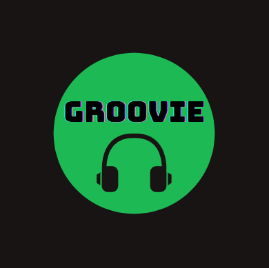

**Welcome to the Groovie Project**

---

## Introduction
Welcome to the Groovie project repository! 
Groovie is a Java-based application developed by our group at UTArlington's Object Oriented Programming class. 
This project showcases our skills in software development, including the utilization of UML diagrams and Java Swing for the user interface.

---

## Getting Started
Prerequisites
To run Groovie, ensure you have the following installed on your system:

Java Development Kit (JDK) version 8 or higher
VS Code with Java libraries installed

---

## Installation
Clone the repository to your local machine:

---

## Running the Application
To run Groovie, follow these steps:

Navigate to the directory.
Locate GroovieMain.java.
Run GroovieMain.java as a Java application.

---

## Usage
1.)Starting up, the program will ask for your name.
2.)Afterwards, it will load you into the application where you can create or play your playlists!
3.)Enjoy your bops!

---

## Contact
For any inquiries or feedback, please contact Danny2009le.com.

Thank you for your interest in the Groovie project! We hope you find it useful and enjoyable. Happy coding! 🚀
